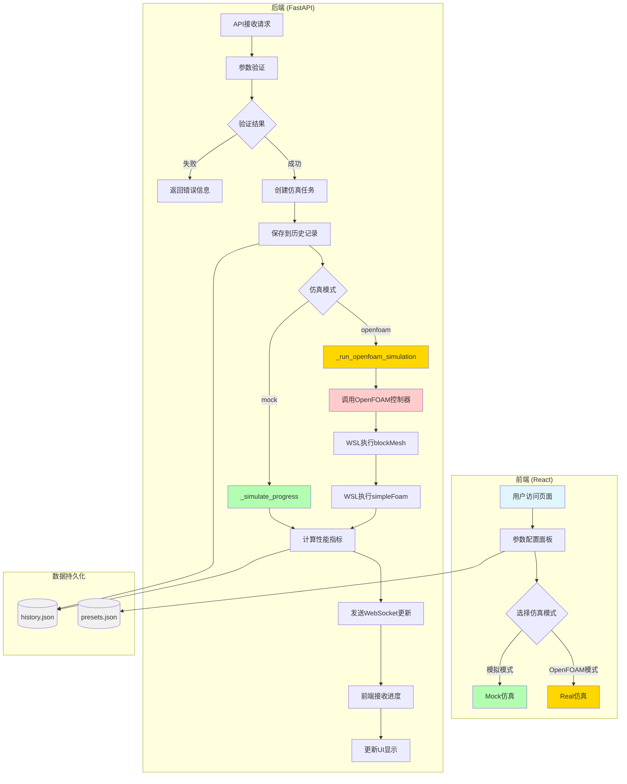

# AI驱动的微通道散热器智能设计系统

基于 OpenFOAM 和人工智能的微通道散热器智能设计系统 (V1.0)

## 系统架构简图

```
┌─────────────────────────────────────────────────────────────────────────┐
│                          用户界面 (React + Ant Design)                    │
│  ┌─────────────┐   ┌─────────────────┐   ┌─────────────────────────┐   │
│  │ 参数配置面板 │──▶│ 仿真监控面板    │──▶│ 结果展示/3D可视化       │   │
│  └─────────────┘   └─────────────────┘   └─────────────────────────┘   │
└─────────────────────────────────────────────────────────────────────────┘
                                    │ WebSocket / REST API
                                    ▼
┌─────────────────────────────────────────────────────────────────────────┐
│                         后端服务 (FastAPI)                               │
│  ┌─────────────┐   ┌─────────────────┐   ┌─────────────────────────┐   │
│  │ 参数验证    │──▶│ 仿真任务管理    │──▶│ OpenFOAM控制器          │   │
│  └─────────────┘   └─────────────────┘   └─────────────────────────┘   │
│                                              │                          │
│  ┌─────────────┐                            ▼                          │
│  │ 数据持久化  │◀────────────────── WSL │ OpenFOAM v11               │
│  └─────────────┘                            │                          │
└─────────────────────────────────────────────────────────────────────────┘
```

## 系统简介

本系统是一款面向微通道散热器设计的智能仿真平台，支持：
- 自然语言参数解析
- 快速仿真（基于工程公式）
- 真实 OpenFOAM CFD 仿真
- 实时进度监控与结果可视化

## 技术架构

- **前端**：React + TypeScript + Vite + Ant Design
- **后端**：FastAPI (Python)
- **通信**：REST API + WebSocket
- **仿真引擎**：OpenFOAM v11 (WSL Ubuntu-24.04)

## 项目结构

```
heat_exchanger_ai/
├── backend/                    # FastAPI 后端服务
│   ├── main.py                 # 主入口
│   ├── models/                 # 数据模型
│   ├── services/               # 业务服务
│   │   ├── simulation_manager.py   # 仿真流程管理
│   │   ├── openfoam_service.py     # OpenFOAM 集成
│   │   ├── llm_service.py          # LLM 服务
│   │   └── data_storage.py         # 数据持久化
│   └── websocket/              # WebSocket 管理
├── frontend/                   # React 前端应用
│   ├── src/
│   │   ├── components/         # React 组件
│   │   │   ├── ParameterPanel.tsx      # 参数配置
│   │   │   ├── SimulationMonitor.tsx  # 仿真监控
│   │   │   ├── ResultsPanel.tsx       # 结果展示
│   │   │   └── ThreeDVisualization.tsx # 3D 可视化
│   │   ├── services/          # API 服务
│   │   └── stores/             # 状态管理
│   └── package.json
├── src/                        # OpenFOAM 控制器模块
│   └── foam_controller.py      # OpenFOAM Python 接口
├── openfoam_templates/         # OpenFOAM 案例模板
│   └── microchannel/           # 微通道散热器模板
├── docs/                       # 文档
├── config/                     # 配置文件
└── README.md
```

## 系统工作流程



### 流程说明

1. **用户访问** → 用户通过前端界面配置仿真参数
2. **参数配置** → 选择预设或自定义参数，设定仿真模式
3. **API请求** → 前端通过 REST API 发送仿真请求
4. **参数验证** → 后端验证参数合法性（范围检查、关联验证）
5. **仿真执行**
   - **模拟模式**：基于工程公式快速计算
   - **OpenFOAM模式**：通过WSL调用真实CFD求解器
6. **实时更新** → 通过WebSocket向前端推送进度
7. **结果展示** → 仿真完成后展示性能指标和可视化

## 快速开始

### 环境要求

- Python 3.10+
- Node.js 18+
- WSL Ubuntu-24.04 (用于 OpenFOAM)
- NVIDIA GPU (可选，用于加速)

### 1. 安装后端依赖

```bash
cd heat_exchanger_ai/backend
pip install -r requirements.txt
```

### 2. 安装前端依赖

```bash
cd heat_exchanger_ai/frontend
npm install
```

### 3. 配置环境变量

创建 `frontend/.env` 文件：

```env
VITE_API_URL=http://localhost:8000/api
VITE_WS_PORT=8000
```

### 4. 启动后端服务

```bash
cd heat_exchanger_ai/backend
python -m uvicorn main:app --host 0.0.0.0 --port 8000 --reload
```

### 5. 启动前端应用

```bash
cd heat_exchanger_ai/frontend
npm run dev
```

访问 `http://localhost:5173` 即可使用系统。

## 仿真模式

### 模拟模式 (Mock)

基于工程公式的快速仿真，无需 OpenFOAM。适用于参数验证和初步设计评估。

### OpenFOAM 模式 (Real)

使用 OpenFOAM 进行真实 CFD 仿真。需要 WSL 中安装 OpenFOAM v11。

```bash
# 在 WSL 中安装 OpenFOAM
wsl -d Ubuntu-24.04
# Follow OpenFOAM installation instructions
```

## 参数说明

| 参数类别 | 字段 | 单位 | 说明 |
|---------|------|------|------|
| **几何参数** | channel_width | m | 通道宽度 (1μm - 1cm) |
| | channel_height | m | 通道高度 (1μm - 1cm) |
| | channel_length | m | 通道长度 |
| | channel_count | - | 通道数量 (1-1000) |
| | wall_thickness | m | 壁厚 |
| **流动参数** | inlet_velocity | m/s | 入口速度 (≤100) |
| | inlet_temperature | K | 入口温度 |
| | outlet_pressure | Pa | 出口压力 |
| **热参数** | heat_flux | W/m² | 热通量 (≤10MW) |
| | base_temperature | K | 基底温度 |
| **材料参数** | fluid_type | - | 流体类型 (water/air/ethylene_glycol/engine_oil) |
| | solid_material | - | 固体材料 (copper/aluminum/steel/silicon) |

## API 端点

| 方法 | 端点 | 说明 |
|------|------|------|
| GET | `/api/health` | 健康检查 |
| POST | `/api/parse-description` | 自然语言解析 |
| POST | `/api/validate-parameters` | 参数验证 |
| POST | `/api/simulation/start` | 开始仿真 |
| GET | `/api/simulation/{id}/status` | 获取状态 |
| POST | `/api/simulation/{id}/stop` | 停止仿真 |
| GET | `/api/simulation/{id}/results` | 获取结果 |
| GET | `/api/history` | 历史记录 |
| GET | `/api/presets` | 参数预设 |

## WebSocket 通信

连接 URL: `ws://localhost:8000/ws/simulation/{simulation_id}`

消息类型：
- `subscribe` - 订阅仿真更新
- `progress` - 进度更新
- `completed` - 仿真完成
- `error` - 错误通知
- `control` - 控制命令 (pause/resume/stop)

## 数据文件

- `backend/data/simulations/history.json` - 仿真历史记录
- `backend/data/presets/presets.json` - 参数预设

## 开发指南

详细开发指南请参阅 `docs/` 目录下的文档：

- `系统运行逻辑报告.md` - 系统完整运行逻辑
- `环境搭建与部署指南.md` - 环境配置说明
- `GPU加速配置指南.md` - GPU 加速配置

## 许可证

MIT License

## 版本历史

- **V1.0** (2026-03-11) - 初始版本，支持微通道散热器设计和仿真
